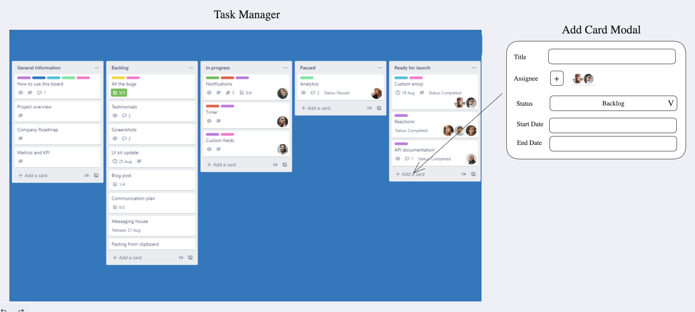
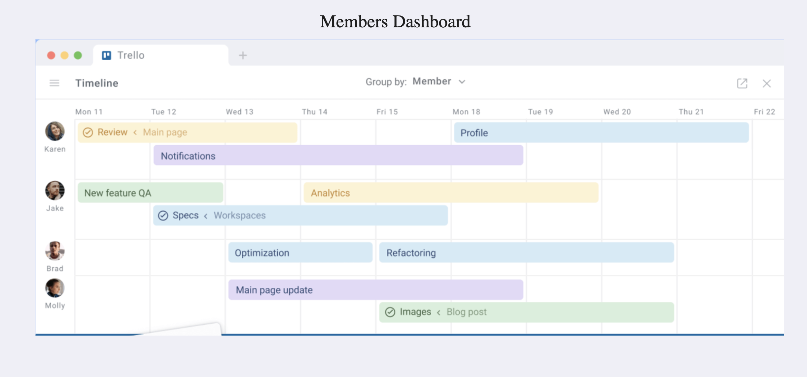

# Neugence UI / UX Assignment

1. Fork this Repo https://github.com/neugence/uiuxassignment
2. Complete the assignment and host the app
3. Create a Pull request with hosted app link only (no code)
4. We will go into the code during interview
   * We encourage you to use AI Tools for code writing
   * We will go deep into the code to check your knowledge
5. Any questions (our developer will answer here), 
   * Discord Server: https://discord.gg/mW8xvN9qjx
   * Channel : https://discord.com/channels/1281837569373503652/1335275549429334149

# Build a Smart Task Manager  

## 📌 Problem Statement  
Your challenge is to **design and develop a fully functional Task Management System** inspired by the reference images:  

- **Task Manager UI**   
- **Timelines Dashboard**   

This application should allow users to:  
✅ **Create, edit, and manage tasks** with a **modal window**.  
✅ **Track task timelines** in an interactive dashboard.  
✅ **Filter, sort, and search** through a **large dataset** efficiently.  
✅ Ensure **seamless user experience** with a **modern, responsive UI**.  

💡 **Bonus:** Bring your **creativity** to add **unique and valuable features**!  

---

## 🛠 Evaluation Criteria  
A **flawlessly working** application is the **ideal goal**, but **innovation** and **thoughtful improvements** will set you apart!  

We will assess your work based on:  
✔️ **Functional Completion** – Does the app work as expected?  
✔️ **Code Readability & Maintainability** – Clean, well-structured, and scalable code.  
✔️ **Performance Optimization** – Efficient rendering with minimal re-renders.  
✔️ **UI/UX Excellence** – A visually appealing and accessible design.  
✔️ **Debugging & Problem-Solving** – Effective handling of errors and edge cases.  

---

## 🧩 Task Breakdown  

### 1️⃣ React Challenge  
🔹 **State Management**: Use **Zustand** for managing task data.  
🔹 **React Hooks**: Implement `useState`, `useEffect`, `useMemo`, and `useCallback` **effectively**.  
🔹 **Prop Drilling**: Structure components with a clear data flow.  
🔹 **Pagination**: Implement pagination for a dataset of **at least 50 records**.  
🔹 **Filters & Sorting**: Allow users to filter and sort tasks dynamically.  
🔹 **Click-to-Edit Fields**: Enable inline task editing, saving data in **state**.  
🔹 **Drag & Drop (useRef)**: Allow users to **reorder** tasks in the list via **drag & drop**.  
🔹 **Modal Window**:  
   - Used for **adding and editing tasks**.  
   - Should close on **Escape key** and **outside click**.  

💡 **Bonus Features:**  
⭐ **Map Data Efficiently** – Store task data using a **map structure**, with **email ID as the key**.  
⭐ **Optimized Rendering** – Use **`useMemo`** and **`useCallback`** to minimize unnecessary re-renders.  

---

### 2️⃣ Data Structures & Performance  
🔹 **Efficient Mapping** – Handle large datasets effectively.  
🔹 **Optimize Component Rendering** – Use **memoization** where necessary.  

---

### 3️⃣ APIs & Database  
🔹 **Debugging & Error Handling** – Ensure robust logging and graceful error handling.  

---

## 🎨 Why This Challenge?  
This problem **mimics real-world UI/UX projects**, where **efficiency, interactivity, and user experience** are equally important. It will **help you grow** as a **UI/UX developer** while **showcasing your creativity**!  

💡 **Get creative, keep the UI sleek, and make the app intuitive to use!** 🎨✨  